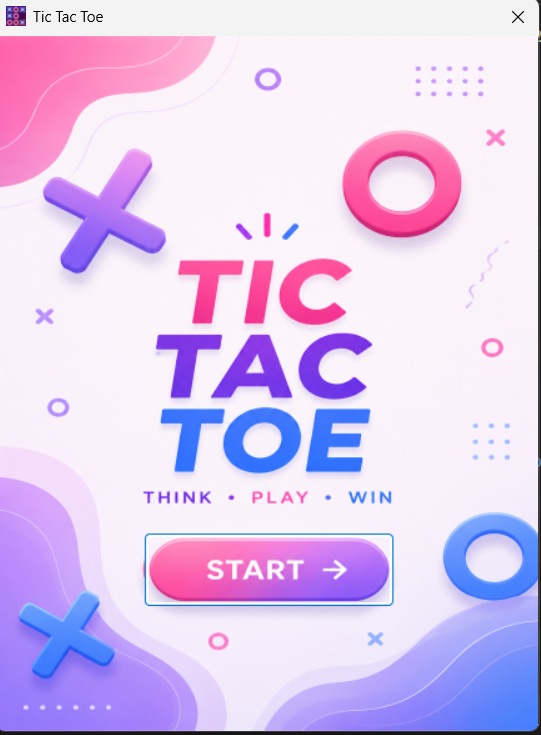
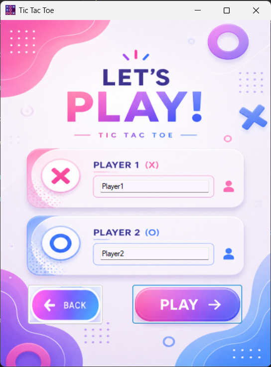
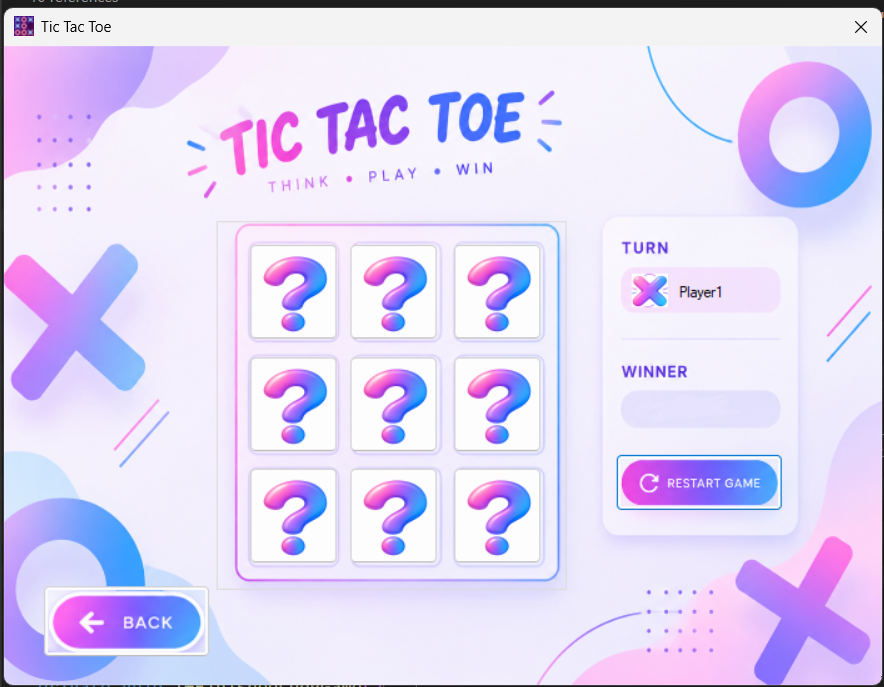

# TicTacToe (Windows Forms | C#)

A classic two-player Tic-Tac-Toe game built with C# and Windows Forms, following a clean separation between game logic and UI.

## Features

- Two-player local gameplay with custom player names
- Multi-screen flow: start screen → player name entry → game board
- Turn indicator with player name and current mark (X/O)
- Win, loss, and draw detection across all rows, columns, and diagonals
- Restart option without closing the app
- Game logic fully decoupled from the UI layer

## Screenshots

| Start Screen | Player Setup | Game Board |
|:---:|:---:|:---:|
|  |  |  |

## Tech Stack

- **Language:** C#
- **Framework:** .NET (Windows Forms)
- **IDE:** Visual Studio

## Project Structure

```
TicTacToe/
├── frmMain.cs        # Start screen
├── frmPlayer.cs       # Player name entry screen
├── frmGame.cs         # Game board screen (UI only)
├── clsGame.cs          # Core game logic (model) — independent of the UI
├── Properties/         # Assembly info and app settings
├── Resources/           # Game images (X, O, placeholder icon)
└── TicTacToe.slnx     # Solution file
```

## Architecture Notes

The game logic lives entirely inside `clsGame`, a standalone class with no dependency on any Windows Forms control. It tracks the board state, whose turn it is, and determines the winner. The `frmGame` form only handles rendering and user input, then calls into `clsGame` to update the state. This separation makes the core game logic easier to read, maintain, and test independently of the UI.

## How to Run

1. Clone the repository:
   ```
   git clone https://github.com/farida285/-TicTacToe.git
   ```
2. Open `TicTacToe.slnx` in Visual Studio.
3. Press **Start** (or F5) to build and run the project.

## Author

**Farida** — [github.com/farida285](https://github.com/farida285)
